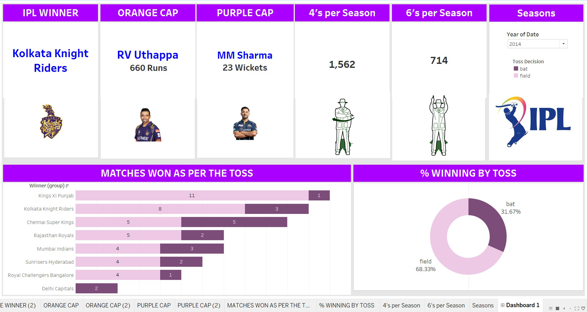

# IPL_Analysis
Tableau dashboard analyzing IPL cricket matches (2008-2020)
# IPL Analysis Dashboard (2008-2020)

## Overview
This project demonstrates a comprehensive data analysis and visualization of the Indian Premier League (IPL) matches from 2008 to 2020, using Tableau. It highlights key aspects of the tournament, such as winning teams, standout player performances, and season trends. The primary goal of this project is to explore and communicate complex data effectively through interactive visualizations.

### Key Metrics and Features
1. **IPL Winner**:
   - Highlights the champion team for the selected season.
   - Includes the team's logo for visual branding.

2. **Orange Cap**:
   - Displays the leading run-scorer for the season with total runs scored.
   - Enhances personalization with a player photo.

3. **Purple Cap**:
   - Showcases the leading wicket-taker with total wickets claimed.
   - Includes relevant visuals for emphasis.

4. **4's and 6's per Season**:
   - Provides the total number of boundaries and sixes hit in the selected season, representing the entertainment aspect of the IPL.

5. **Seasons Filter**:
   - Includes an interactive dropdown to filter the data by specific years, enabling detailed exploration.

6. **Winning Insights**:
   - **Matches Won as per the Toss**: A stacked bar chart categorizing team wins based on toss decisions.
   - **% Winning by Toss**: A donut chart visualizing the proportion of matches won by teams opting to bat versus field.

## Files
- `IPL_Analysis_Dashboard.twbx`: Tableau dashboard file
- `data/`: Folder containing datasets
- `screenshot/`: Folder containing dashboard screenshot

## Tableau Functions Used
### 1. **Data Visualization**
- **Clear Storytelling**:
  - Presenting a cohesive narrative by combining season highlights, player performance, and strategic insights.
- **Color Coding and Branding**:
  - Consistent usage of purple,ensuring professional and visually appealing design.
- **Effective Chart Selection**:
  - Bar and donut charts are used enhance interpretability and provide actionable insights.

### 2. **Interactivity**
- **Filter Integration**:
  - The season dropdown allows users to interact with the data, customizing the experience based on their interests.
- **Dynamic Views**:
  - Metrics and charts update dynamically based on the selected season, showcasing advanced filtering capabilities.

### 3. **Advanced Features**
- **Icons and Images**:
  - Player photos, team logos, and cricket-themed icons improve user engagement and provide context.
- **Dashboard Layout**:
  - The layout balances text, visuals, and charts, delivering information in a structured and user-friendly format.

### 4. **Insights Delivery**
- **Matches Won as per the Toss**:
  - Visualizes team performance based on toss decisions, helping identify trends and strategies.
- **Cumulative Stats (4's and 6's)**:
  - Highlights season-level entertainment metrics for cricket enthusiasts.

## Dashboard Preview

## Tableau Public link fot the dashboard
https://public.tableau.com/views/IndianPrimiereLeague/Dashboard1?:language=en-US&:sid=&:redirect=auth&:display_count=n&:origin=viz_share_link

## Conclusion
This dashboard is a comprehensive representation of IPL data, blending statistical analysis with engaging visuals. It reflects a high level of proficiency in **Tableau**, including interactivity, customization, and effective storytelling. The project demonstrates:
- Advanced visualization techniques.
- Data filtering and dynamic updates.
- Audience-centric design for meaningful insights.
